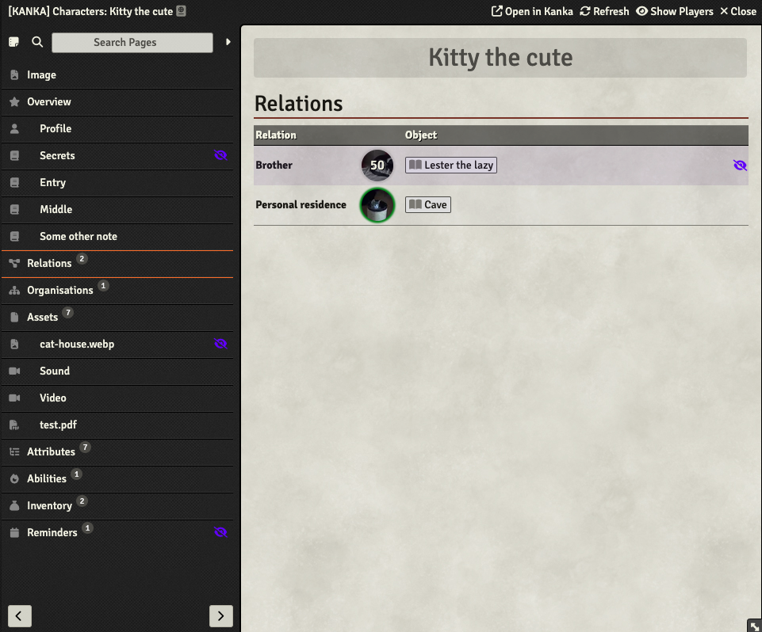
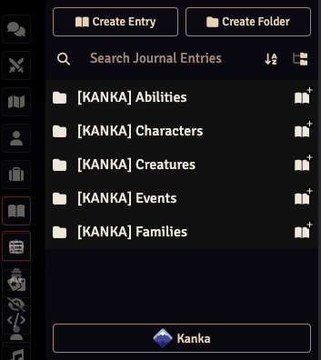

# Kanka-Foundry
This is a module which integrates [Kanka.io](https://kanka.io), a free worldbuilding and tabletop RPG campaign
management tool, with [Foundry Virtual Tabletop](http://foundryvtt.com), allowing you to import entities written
in Kanka as journal entries into Foundry VTT. This module imports full Kanka entities, including their main entry text,
image, relations and other data. This is not an official module, but a fan creation by someone who uses both Kanka and
Foundry VTT.

## Installation
This module can be installed from the Foundry Virtual Tabletop module browser, or by using the following module
manifest url: https://github.com/eXaminator/kanka-foundry/releases/latest/download/module.json.

## Features
- Import entities from Kanka to use and share them within Foundry VTT as Journal Entries. These entries will display
almost everything from the Kanka entries, including:
  - Name, image and entry text
  - Details depending on the type of entity (type, title, age, sex)
  - Attributes, notes, relations, inventory, abilities
  - The Details tab of each entity will also include pinned or starred attributes, notes and relations
- Roughly integrate the permissions of Kanka into the permission system of Foundry VTT
  - Owners can see everything but secret elements are marked as such
  - Observers see everything that is not "secret"
  - Since Kanka has multiple permission management systems, this module just tries its best to show / hide the
    information as needed. Everything that is either marked as "private" or has a "visibility" of anything other than
    "members" or "all" will be handled as secret.
- Dynamically link between imported Journal Entries to allow easy navigation of all your data without leaving your VTT.
- Show which entities are outdated and need to be updated.
- Show the completion status of Kanka quests in the journal sidebar.

## Configuration
This module provides many configuration options to handle authentication to Kanka as well as details on how do display
imported data.

- **Kanka Personal Access Token**: This token is necessary for this module to access the Kanka API to retrieve your
entities for you. You can create a new *Personal Access Token** by logging into Kanka and going to the following URL:
https://kanka.io/en/settings/api. Access Tokens are usually valid for 1 year before you need to create a new one.
This module should warn you starting a week before it expires.
- **Campaign**: After entering a valid Access Token you should receive a list of all Kanka campaigns you have access
to. You must select the campaign you would like to import data from. You can always change the campaign later to import
entities from another campaign without loosing what you have already imported.
- **Content language**: By default all labels within journal entries will use the same language you are using foundry
in. But if you have written your Kanka entries in another language, it may seem strange to have mixed languages within
the entries. Therefore you can change the language in which to display journal entries with this setting. Keep in mind
that the languages this module supports are limited. If your language is missing, feel free to open a Pull Request
to add translations for your favored language.
- **Create folder tree**: Some entities in Kanka can be organized hierarchically. If this option is selected, the module
will create folders to replicate this hierarchy. Foundry has a limit of 3 folders levels, thus everything on a lower
level will be flattened to this 3rd level instead.
- **Include image in text**: When importing an entity from Kanka it will use its main image as the journal entries image 
in foundry. With this setting the image will additionally be displayed in the journal entry next to its meta data and
text.
- **Automatically set permissions**: When importing an entity, set the best default permission based on whether the
entity is marked as private or public. This can be set to never sync the permissions, only sync them on the initial
import or sync them for every import (and potentially override manually set default permissions).
- **Quest status icon**: Adds an icon in front of every Kanka quest in the journal sidebar to show whether it is
completed or not.
- **Show private entities**: If you disable this option, the module won't allow you sync entities that were marked as
private in Kanka. Private entities that were imported before changing this setting will remain in your journal but can't
be refreshed from Kanka until this setting has been enabled again.
- **Remove external links**: If this option is selected all links to other kanka entities will be removed unless those
entities have been imported to Foundry themselves.

## Usage
After installing and configuring the module, you will find a button with the Kanka icon next to the buttons to create
new journal entries.

Clicking this button will open an overview of all your Kanka entities based on their category. You can view the entities
either as a list or in a grid view. Each entity has a button to link the entity. This will create a journal folder and
import that entity into that folder. After linking an entity you will now  see a button to open the linked journal entry,
as well as a button to update this entity from Kanka. If the entity was changed in Kanka since the last update
the entry will have a red background and an appropriate icon over its image. Automatically created folders can be renamed
once they were created. The module will keep importing new entities into the same folder without problems.

Next to each category you will also find buttons to link all entities in that category that have not been linked before
or to refresh all entities that are outdated. Please beware API request limits, see below.

### API limitations
The Kanka API enforces certain rate limits. For most users this means that you cannot make more than 30 requests per
minute. Kanka subscribers have a higher limit of 90 requests per minute. I have tried to limit the number of requests as
best as possible, but there is always room for improvement, and some entries simply require more requests than others.
This module monitors the amount of requests it is making against the Kanka API and will simply wait if the limit was
reached. This can sometimes create wait times, especially when linking or updating many entities at once.

### Outdated references
Many entities can reference other entities, like members of an organisation, inventories or just general relations. 
Each linked entity also keeps a list of those references so that it can display things like the name or image of
those references. This can lead to situations, where these references are outdated, because the referenced entity was
changed in Kanka. There are 2 ways to handle this:
1. You can update the entity that has these references, in which case the references will also update.
2. You can link (or update) the referenced entity itself. If Kanka-Foundry finds a Journal Entry for a referenced entity
it will always take the information from that instead of its own snapshot for that reference.

## Software License and Contribution Policy
This software is licensed under the MIT License. See the LICENSE file in this repository for details.

## Contribution
All issues and merge requests are welcomed. But please understand if I cannot always immediately comment or review
your contribution. Merge requests will always receive a code review by me and must adhere to my general standards and
style (which are not really documented at this point). I at least expect eslint and typescript to not throw any errors
when running `npm run check`.
