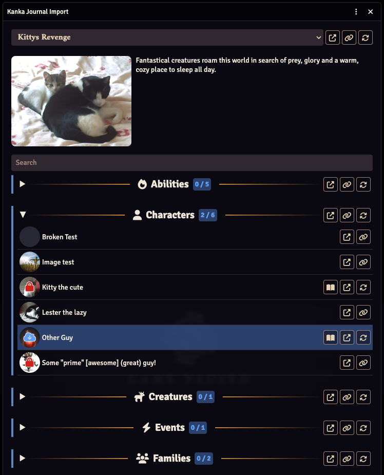

# Kanka-Foundry
This is a module which integrates [Kanka.io](https://kanka.io), a free worldbuilding and tabletop RPG campaign
management tool, with [Foundry Virtual Tabletop](http://foundryvtt.com), allowing you to import entries written
in Kanka as journal entries into Foundry VTT. this module imports Kanka entries including their main entry text,
their main image and some metadata, which will be included as a table above the main entry text.

This module is based loosely on the
[Forundry Virtual Tabletop - World Anvil Integration](https://gitlab.com/foundrynet/world-anvil) module.

## Installation
This module can be installed from the Foundry Virtual Tabletop module browser, or by using the following module
manifest url: https://github.com/eXaminator/kanka-foundry/releases/latest/download/module.json.

## Configuration
This module provides many configuration options to handle authentication to Kanka as well as what to import.

- **Kanka Personal Access Token**: This token is necessary for this module to access the Kanka API to retrieve your
entries for you. You can create a new *Personal Access Token** by logging into Kanka and going to the following URL:
https://kanka.io/en/settings/api. Access Tokens are usually valid for 1 year before you need to create a new one.
This module should warn you starting a week before it expires.
- **Campaign**: After entering a valid Access Token you should receive a list of all Kanka campaigns you have access
to. You must select the campaign you would like to import data from. You can always change the campaign later to import
entries from another campaign without loosing what you have already imported.
- **Create folder tree**: Most entries in Kanka can be organized hierarchically. If this option is selected the module
will create folders to replicate this hierarchy. Foundry has a limit of 3 folders levels, thus everything on a lower
level will be flattened to this 3rd level instead.
- **Include image in text**: When importing an entry from Kanka it will use the entries main image as the journal
entries image. With this setting the image will additionally be displayed in the journal entry next to its text
(see screenshot bellow).
- **Show private entities**: If you disable this option, the module won't allow you sync entries that were marked as
private in Kanka. Private entries that were imported before changing this setting will remain in your journal but can't
be refreshed from Kanka until this setting has been enabled again.
- **Basic metadata import**: This setting allows you to define which *basic* metadata should be imported. *Basic*
metadata includes properties like the *type* given to most entries in Kanka, *age* for characters and other basic
properties.
- **Attributes import**: The module will import attributes on any Kanka entry as metadata. This setting allows you to
broadly define which attributes to import this way.
- **Inventory import**: The module will import inventory for all entries as metadata. This setting allows you to control
which inventory entries will be imported.
- **Character trait import**: Characters in Kanka have appearance and personality traits. This setting allows you to
select which of those traits you would like to import.
- **Quest reference import**: Quests can contain references to Characters, Locations and other entries. This setting
allows you to choose which references to import. The *public* setting is based on the *private* flag of each
reference itself, not the private flag of the referenced entry.

Additionally, the settings provide a list of all supported Kanka entry types to allow you to deselect certain types
hand have the module hide those in the import view. Deselecting types has two advantages:
1. It reduces the amount of lists you have visible, especially if you don't use certain modules in Kanka itself.
2. It reduces the amount of API requests this module has to send to Kanka. Please see below for more information on
API limitations for the amount of requests.

## Usage
After installing and configuring the module, you will find a button with the Kanka icon next to the buttons to create
new journal entries.

Clicking this button will open an overview of all your Kanka entries based on their category. The exact entries that
show up here depends on what you have selected in the settings of this module. Each entry has a button to link the
entry. This will create a journal folder and import that entry into that folder. After linking an entry you will now
see a button with the entries name which will open the linked journal entry. If the entry was updated in Kanka since
the last refresh this button will pe prefixed with an asterisk. You will also find a button to refresh the journal
entry, which will start a new import of this entry.

**Warning**: You can change journal entries after you have imported them as much as you like. But keep in mind
that refreshing an entry will overwrite any changes you have made to that journal entries text field or image.

Next to each category you will also find buttons to link all entries in a category that have not been linked before
or to refresh all entries that have already been linked. Please beware API request limits, see below.

### API limitations
The Kanka API enforces certain rate limits. For most users this means that you cannot make more than 30 requests per
minute. Kanka subscribers have a higher limit of 90 requests per minute (which is currently not supported by this
module, but it will be soon!). I have tried to limit the number of requests as best as possible, but there is always
room for improvement, and some entries simply require more requests than others. This module monitors the amount of
requests it is making against the Kanka API and will simply wait if the limit was reached. This can sometimes create
wait times, especially when linking or refreshing many entries at once.

**Advice**: Kanka has a profile setting which changes the default amount of elements that are displayed in a list. This
same value is used when the module accesses the API to retrieve data. If you have a lot of elements in some categories
it would help to increase this to the largest possible value (currently 45) to reduce the number of requests this
module has to make to retrieve all elements.

## Software License and Contribution Policy
This software is licensed under the MIT License. See the LICENSE file in this repository for details.

## Contribution
All issues and merge requests are welcomed. But please understand if I cannot always immediately comment or review
your contribution. Merge requests will always receive a code review by me and must adhere to my general standards and
style (which are not really documented at this point). I at least expect eslint and typescript to not throw any errors
when running `npm run check`.
